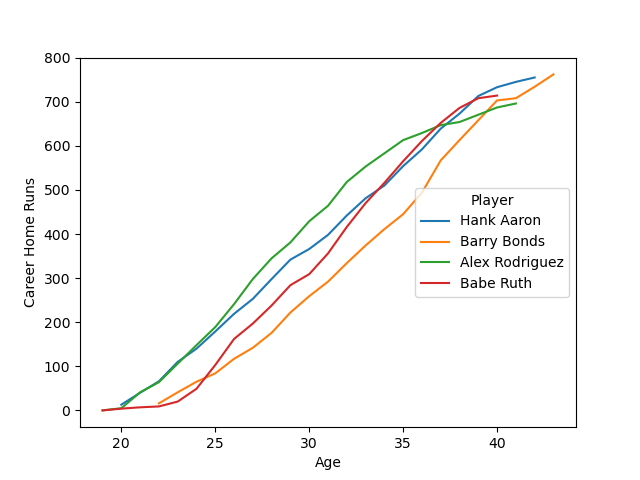

# My Data Analyst Portfolio

## Python, Pandas, Seaborn

### Home Run Trajectories

The book [Analyzing Baseball Data with R](https://beanumber.github.io/abdwr3e/01-datasets.html#sec-lahman) introduces the Lahman data set and gives an example usage for plotting the career home run trajectories of four prolific hitters. I created a simimlar plot using Python, Pandas and Seaborn. Here is the Python code:

```
#!/usr/bin/env python
import matplotlib.pyplot as plt
import pandas as pd
import seaborn as sns

batting = pd.read_csv('Batting.csv')
people = pd.read_csv('People.csv', encoding_errors='ignore')
people['Player'] = people['nameFirst'] + ' ' + people['nameLast']
merged = pd.merge(batting, people, on=['playerID', 'playerID'])
merged['Age'] = merged['yearID'] - merged['birthYear']
merged['Career Home Runs'] = merged.groupby('playerID')['HR'].cumsum()
filtered = merged.query("Player in ['Hank Aaron', 'Barry Bonds', 'Alex Rodriguez', 'Babe Ruth']")
ax = sns.lineplot(filtered, x='Age', y='Career Home Runs', hue='Player')
sns.move_legend(ax, "center right")
plt.show()
```

This displays the following plot:



[YouTube video tutorial](https://youtu.be/dsg0zK6EFAE) on creating this same visual using Power BI.
